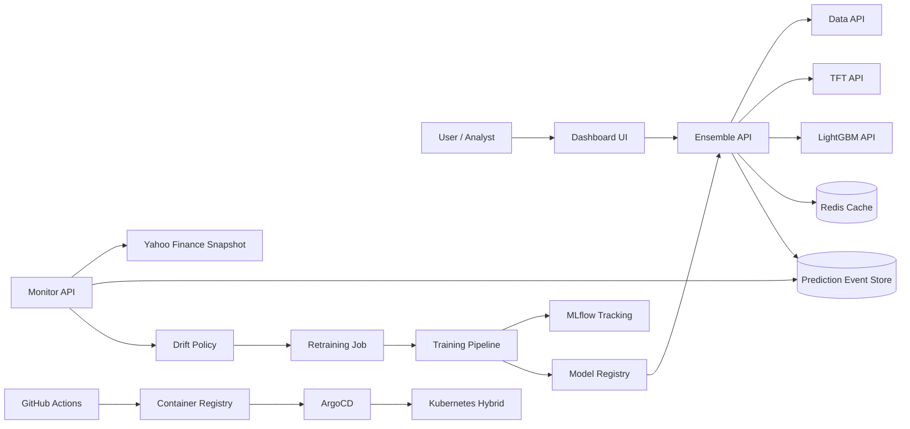
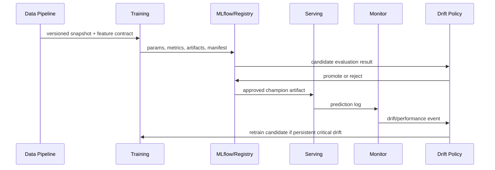

# MLOps Stock — Architecture

## 1. Logical architecture

## 2. MLOps lifecycle

## 3. Thành phần chính

| Thành phần | Trách nhiệm | Trạng thái triển khai |
|---|---|---|
| Data API | Lấy OHLCV, indicators và target contract | Kế thừa và harden |
| TFT API | Dự báo chuỗi 60 bước, model artifact | Kế thừa và thêm metadata |
| LightGBM API | Dự báo tabular từ feature cuối | Kế thừa và thêm metadata |
| Ensemble API | Gọi song song, scale đúng meta input, decision policy | Đã hoàn thiện local |
| Control API | Prediction logs, drift evaluation, jobs, registry, RBAC demo | Thành phần mới |
| Monitor API | Background drift/performance metrics và Prometheus | Đã nâng cấp |
| Dashboard UI | Prediction, performance, drift, registry, retrain, audit | Đã mở rộng |
| MLflow | Tracking và artifact lifecycle | Kế thừa; local file hoặc server |
| Registry | Candidate/champion/promotion/rollback | Filesystem local; chuyển MLflow/PostgreSQL khi production |
| GitOps manifests | Helm/ArgoCD/K3s/EKS deployment | Đã bổ sung service templates |

## 4. Data contract

Mỗi snapshot phải có ticker, timestamp, OHLCV, feature version, source, downloaded_at và target definition. Các feature dùng trong inference phải trùng schema với training manifest. Mọi preprocessing phải nằm trong training fold khi đánh giá; không fit scaler trên toàn bộ dataset trước walk-forward.

## 5. Hybrid Cloud boundary

Private cluster giữ data ingestion, feature computation, training và control plane. Object storage được version hóa; AWS/EKS chỉ nhận artifact champion hoặc workload serving tối thiểu. IRSA/OIDC được ưu tiên hơn static access keys. Ingress public chỉ expose dashboard/serving cần thiết; Control API phải có authentication thật trước khi expose production.

## 6. Reliability boundaries

Một upstream model có thể fail; Ensemble cần timeout, fallback có kiểm soát và log lỗi. Redis chỉ là cache, không phải source of truth. Champion artifact phải độc lập với cache. Drift event và audit phải bền vững; nếu control database tạm thời unavailable, hệ thống không được tự động promote model.
